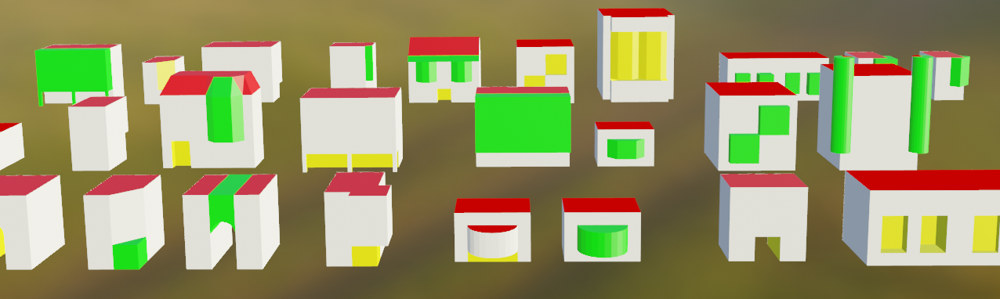

# MinimalHouse
A dataset consisting of 30 building meshes and corresponding annotations.

When using the dataloader, the dataset has the following items:
* Ground-truth mesh with the annotations: roof, wall, convex, concave
* 2.5D building mesh
* Building outline
* Building footprint
* Corresponding point cloud
